<div align="center">

# SBT-DF203 · Lab 3 — SYN Flood Attack Investigation Using TShark

**Network Forensics · TCP Analysis · Incident Investigation**

</div>

---

## Author

| Field | Detail |
| :--- | :--- |
| **Author** | Ibrahim Diseh Garba |
| **Registration No.** | `2025/FWSD/11521` |
| **Programme** | Fellowship in Web Application Security & Digital Forensics |
| **Institution** | International Cybersecurity and Digital Forensics Academy (ICDFA) |
| **Instructor** | Aminu Idris, AMCPN |
| **Submission Date** | 12 September 2026 |
| **Case ID** | `SBT-DF203-Lab3-2025-FWSD-11521` |

<div align="center">

[](https://icdfa.edu.ng)
[](https://icdfa.edu.ng)
[](https://kali.org)
[](https://wireshark.org)
[](https://scapy.net)
[](#license)

</div>

---

## Table of Contents

- [Overview](#overview)
- [Objectives](#objectives)
- [Methodology](#methodology)
- [Section 3 — Environment and Evidence Preparation](#section-3--environment-and-evidence-preparation)
- [Section 4 — Normal Handshake Baseline](#section-4--normal-handshake-baseline)
- [Section 5 — Bounded SYN Simulation](#section-5--bounded-syn-simulation)
- [Section 6 — SYN Indicator Extraction](#section-6--syn-indicator-extraction)
- [Section 7 — Quantitative Analysis](#section-7--quantitative-analysis)
- [Key Findings](#key-findings)
- [Repository Structure](#repository-structure)
- [Evidence and Chain of Custody](#evidence-and-chain-of-custody)
- [Detection and Mitigation](#detection-and-mitigation)
- [Safety and Ethics](#safety-and-ethics)
- [References](#references)
- [License](#license)

---

## Overview

This repository contains the complete evidence package, analysis outputs, simulation scripts, and forensic report for **Lab 3 of SBT-DF203 — Basic Networking Skills for Digital Forensics**.

The investigation establishes a **normal HTTP handshake baseline** against a local Apache service on the loopback interface, then performs a **strictly bounded four-packet SYN simulation** using Scapy. TShark display filters are applied to isolate SYN, SYN-ACK, ACK, and RST behaviour, quantify counts and unique source ports, and produce a defensible forensic timeline.

The analysis distinguishes the *packet pattern* of a SYN flood from proof of an actual denial-of-service event — a key forensic distinction examined in detail below.

---

## Objectives

1. Differentiate a complete TCP three-way handshake from an incomplete (half-open) connection attempt.
2. Apply TShark display filters to isolate SYN, SYN-ACK, ACK, and RST packets.
3. Quantify SYN counts, unique source ports, response behaviour, and incomplete-handshake indicators.
4. Execute a strictly bounded four-packet loopback SYN simulation with Scapy.
5. Develop a defensible forensic timeline and incident finding from PCAP evidence.
6. Recommend detection and mitigation controls for SYN flood activity.

---

## Methodology

| Phase | Description | Output |
| :---: | :--- | :--- |
| **1** | Normal HTTP handshake baseline captured while `curl` requests the Apache default page | `evidence/normal_http.pcapng` |
| **2** | Bounded four-packet SYN simulation crafted with Scapy and captured simultaneously | `evidence/bounded_syn_activity.pcapng` |
| **3** | TShark display filters extract SYN / SYN-ACK / ACK / RST indicators, counts, ports, and expert info | `reports/*.tsv`, `reports/*.txt` |

### Environment

| Component | Version |
| :--- | :--- |
| OS | Kali Linux (ICDFA lab VM) |
| Apache2 | `2.4.68-1` — listening on TCP/80 |
| TShark | `4.6.6-1` |
| Wireshark | `4.6.6-1` |
| Python3-Scapy | `2.7.0+dfsg1-1` |
| Interface | `lo` (loopback only) |

---

## Section 3 — Environment and Evidence Preparation

### 3.1 Folder Structure

```bash
mkdir -p ~/SBT-DF203-Lab3/{evidence,working,exported,reports,screenshots,scripts}
cd ~/SBT-DF203-Lab3
find . -maxdepth 1 -type d -print
```

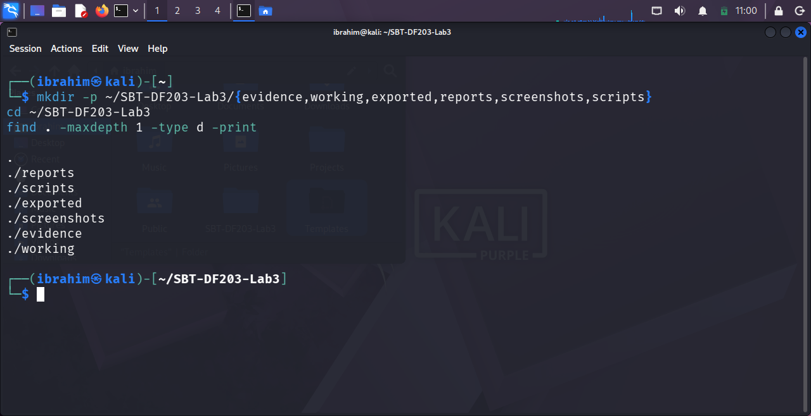

*Figure 3.1 — Lab folder structure showing all six subdirectories: `reports`, `scripts`, `exported`, `screenshots`, `evidence`, `working`.*

### 3.2 Tools Installed and Verified

```bash
sudo apt update
sudo apt install -y apache2 tshark wireshark python3-scapy
sudo systemctl enable --now apache2
sudo ss -lntp | grep ':80'
tshark --version
```

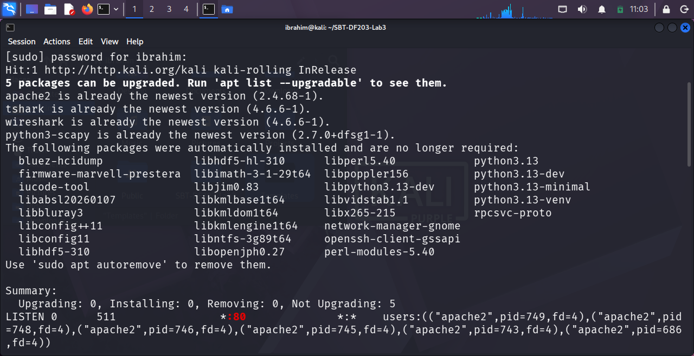

*Figure 3.2 — Apache2 active on TCP/80, TShark 4.6.6, Wireshark 4.6.6, and Python3-Scapy 2.7.0 confirmed.*

### 3.3 Supplied Training Capture (Optional)

The optional supplied training PCAP URL returned **HTTP 404 Not Found** at execution time.

```bash
wget -O evidence/mySYNFloodCapture.pcap \
'https://raw.githubusercontent.com/frankwuxu/digital-forensics-lab/main/Illegal_Possession_Images/lab_files/SYN_Flood/mySYNFloodCapture.pcap'
```

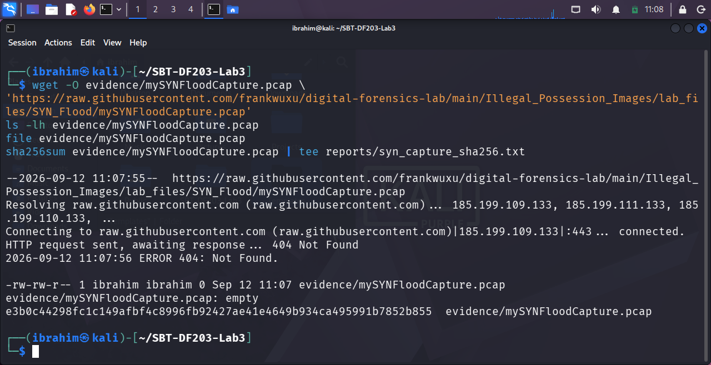

*Figure 3.3 — HTTP 404 response from the optional supplied training PCAP. Since the file is optional, all analysis proceeds from locally generated captures.*

---

## Section 4 — Normal Handshake Baseline

### 4.1 Capture

**Terminal 1:**
```bash
sudo tshark -i lo -f 'tcp port 80' -a duration:15 -w /tmp/normal_http.pcapng
```

**Terminal 2:**
```bash
curl --no-keepalive http://127.0.0.1/ > /dev/null
```

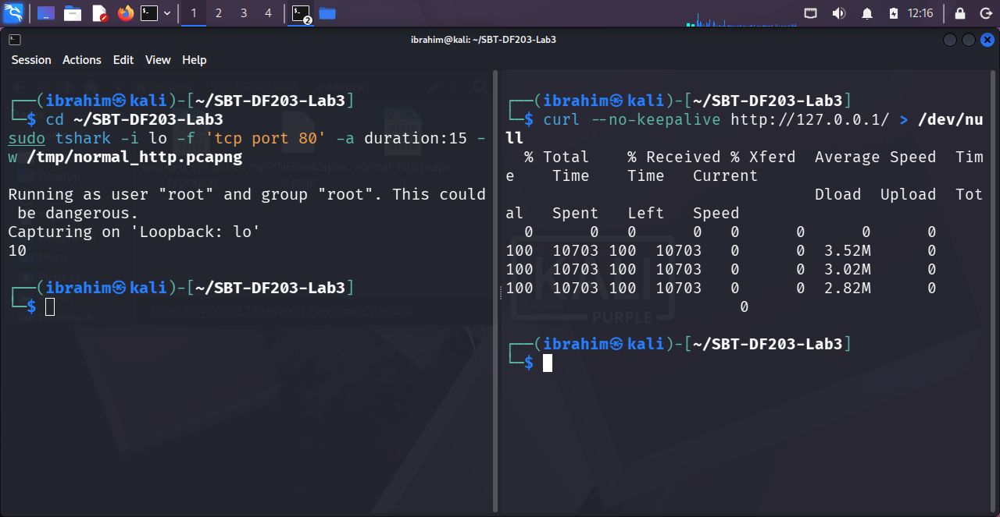

*Figure 4.1 — Dual-pane terminal: capture running on `lo` (left) and curl retrieving 10,703 bytes of HTML (right).*

### 4.2 Extract Handshake Flags

```bash
tshark -r evidence/normal_http.pcapng \
-Y 'tcp.flags.syn==1 || tcp.flags.fin==1' \
-T fields -e frame.number -e frame.time -e ip.src -e tcp.srcport \
-e ip.dst -e tcp.dstport -e tcp.flags \
| tee reports/normal_handshake_flags.tsv
```

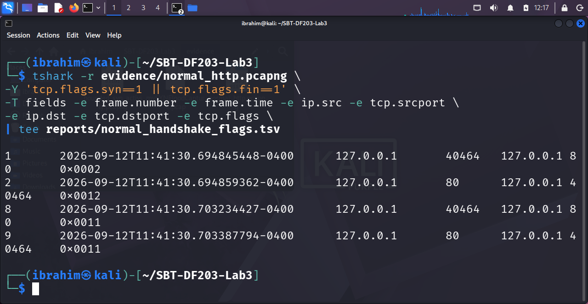

*Figure 4.2 — SYN, SYN-ACK, and two FIN-ACK frames from the clean baseline session. Client port 40464, server port 80.*

### 4.3 Wireshark Visualisation of the SYN Packet

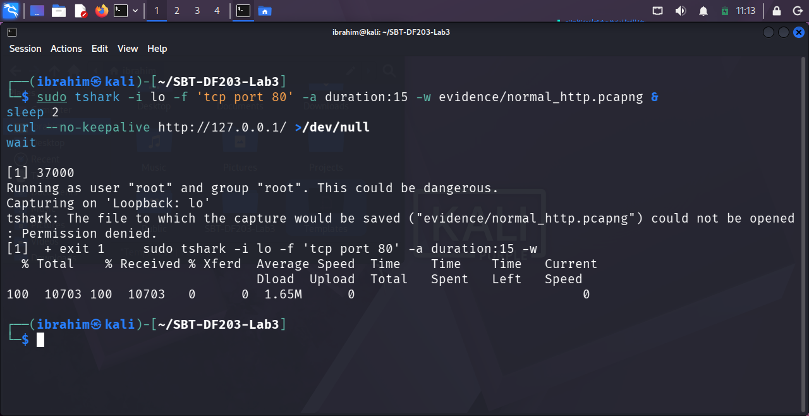

*Figure 4.3 — Frame 1 (SYN) expanded in Wireshark with the display filter `tcp.flags.syn==1 || tcp.flags.fin==1` applied.*

### 4.4 Handshake Table

| Frame | Time | Src | Src Port | Dst | Dst Port | Flags | Interpretation |
| :---: | :--- | :--- | :---: | :--- | :---: | :---: | :--- |
| 1 | 2026-09-12T11:41:30.694845448-0400 | 127.0.0.1 | 40464 | 127.0.0.1 | 80 | `0x0002` | SYN — client initiates |
| 2 | 2026-09-12T11:41:30.694859362-0400 | 127.0.0.1 | 80 | 127.0.0.1 | 40464 | `0x0012` | SYN, ACK — server responds |
| 3 | 2026-09-12T11:41:30.694870764-0400 | 127.0.0.1 | 40464 | 127.0.0.1 | 80 | `0x0010` | ACK — connection established |
| 8 | 2026-09-12T11:41:30.703234427-0400 | 127.0.0.1 | 40464 | 127.0.0.1 | 80 | `0x0011` | FIN, ACK — client closes |
| 9 | 2026-09-12T11:41:30.703387794-0400 | 127.0.0.1 | 80 | 127.0.0.1 | 40464 | `0x0011` | FIN, ACK — server closes |

---

## Section 5 — Bounded SYN Simulation

### 5.1 Scapy Simulation Script

```python
# scripts/syn_probe_lab.py
from scapy.all import IP, TCP, RandShort, send

TARGET = '127.0.0.1'
PORT = 80
COUNT = 4

packets = [IP(dst=TARGET)/TCP(sport=RandShort(), dport=PORT, flags='S')
           for _ in range(COUNT)]
send(packets, verbose=False)
print(f'Sent {COUNT} authorized training SYN packets to {TARGET}:{PORT}')
```

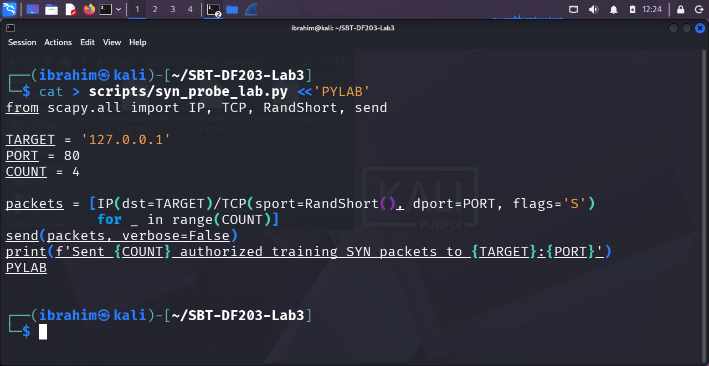

*Figure 5.1 — Bounded Scapy script showing target (127.0.0.1), port (80), and packet count (4).*

### 5.2 Capture and Execute

```bash
# Terminal 1
sudo tshark -i lo -f 'tcp port 80' -c 20 -w /tmp/bounded_syn_activity.pcapng

# Terminal 2
sudo python3 scripts/syn_probe_lab.py
```

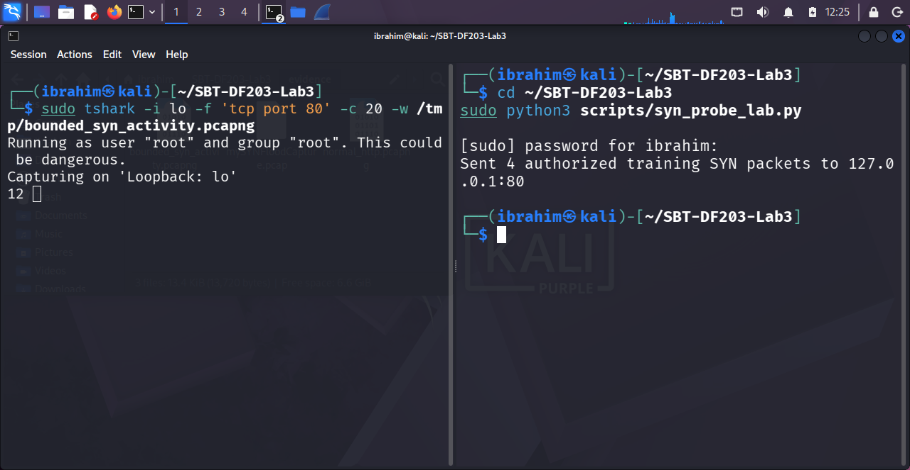

*Figure 5.2 — Simulation output: `Sent 4 authorized training SYN packets to 127.0.0.1:80`.*

### 5.3 Preserve and Hash

```bash
sudo cp /tmp/bounded_syn_activity.pcapng evidence/bounded_syn_activity.pcapng
sudo chown ibrahim:ibrahim evidence/bounded_syn_activity.pcapng
sudo chmod 644 evidence/bounded_syn_activity.pcapng
cp --preserve=timestamps evidence/bounded_syn_activity.pcapng working/bounded_syn_activity_working.pcapng
sha256sum evidence/bounded_syn_activity.pcapng working/bounded_syn_activity_working.pcapng \
  | tee reports/bounded_capture_hashes.txt
```

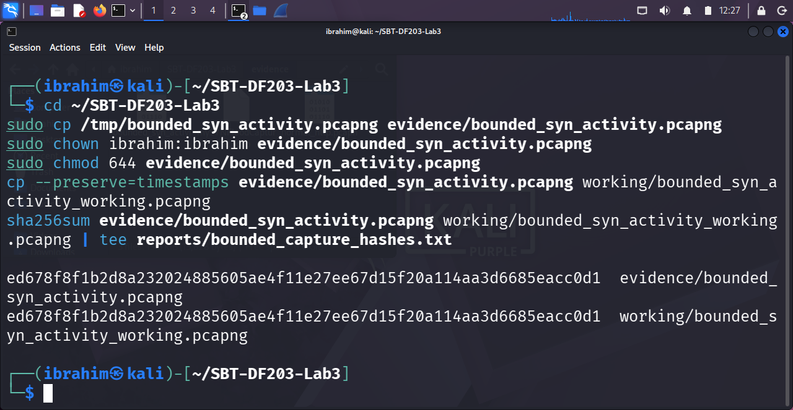

*Figure 5.3 — Original and working copy produce identical SHA-256 hashes, confirming evidence integrity.*

---

## Section 6 — SYN Indicator Extraction

### 6.1 Initial SYN Packets

```bash
PCAP=working/bounded_syn_activity_working.pcapng
tshark -r "$PCAP" -Y 'tcp.flags.syn==1 && tcp.flags.ack==0' \
-T fields -e frame.number -e frame.time_epoch -e ip.src -e tcp.srcport \
-e ip.dst -e tcp.dstport -e tcp.seq | tee reports/initial_syns.tsv
```

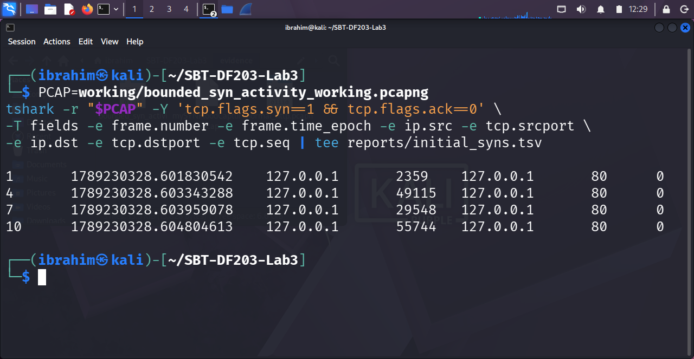

*Figure 6.1 — Four initial SYN packets from unique ephemeral ports (2359, 49115, 29548, 55744), all to 127.0.0.1:80.*

### 6.2 SYN-ACK Responses

```bash
tshark -r "$PCAP" -Y 'tcp.flags.syn==1 && tcp.flags.ack==1' \
-T fields -e frame.number -e frame.time_epoch -e ip.src -e tcp.srcport \
-e ip.dst -e tcp.dstport -e tcp.ack | tee reports/syn_ack_responses.tsv
```

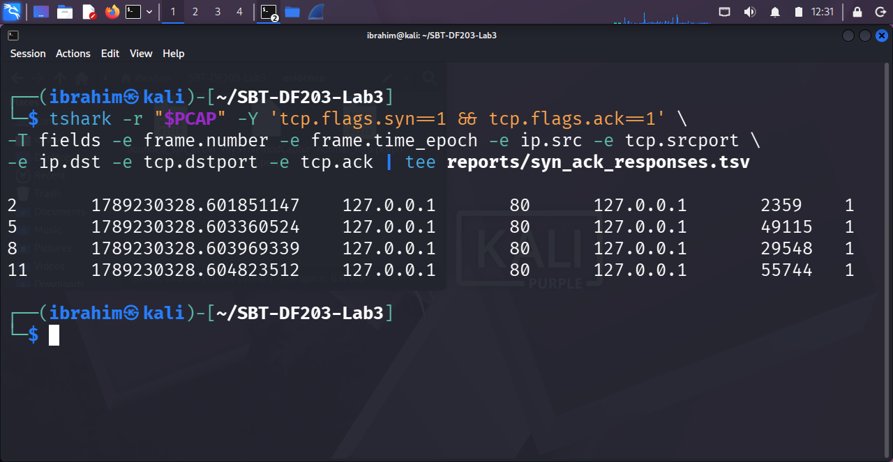

*Figure 6.2 — Four SYN-ACK responses from the Apache server, each acknowledging the SYN with `Ack=1`.*

### 6.3 ACK/RST Candidates

```bash
tshark -r "$PCAP" -Y 'tcp.flags.reset==1 || (tcp.flags.ack==1 && tcp.len==0)' \
-T fields -e frame.number -e frame.time_epoch -e ip.src -e tcp.srcport \
-e ip.dst -e tcp.dstport -e tcp.flags | tee reports/ack_reset_candidates.tsv
```

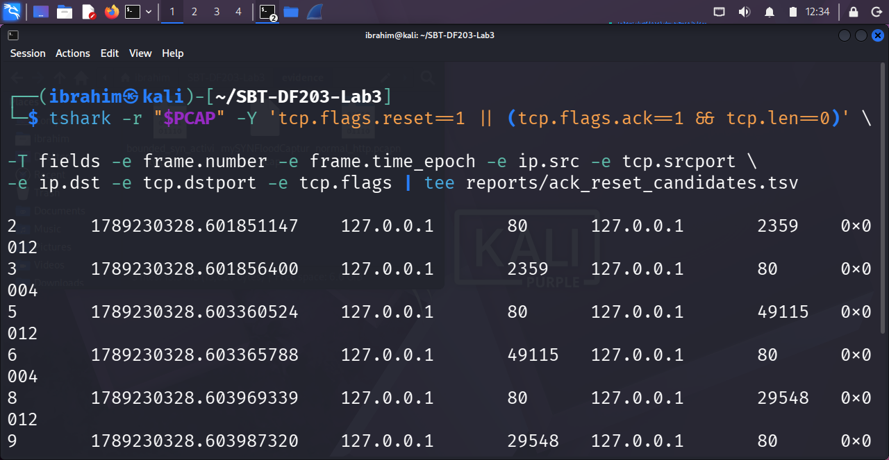

*Figure 6.3 — Alternating SYN-ACK (`0x0012`) and RST (`0x0004`) packets. The client OS rejects each SYN-ACK because no socket exists for the raw Scapy-crafted SYN.*

---

## Section 7 — Quantitative Analysis

### 7.1 Counts by Source and Destination

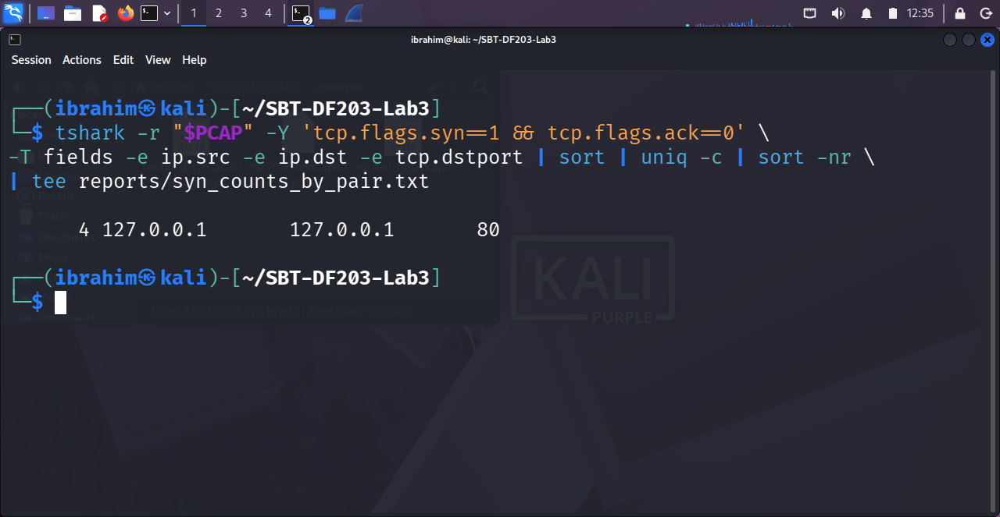

*Figure 7.1 — Four SYN packets all sourced from 127.0.0.1 to 127.0.0.1:80.*

### 7.2 Unique Client Source Ports

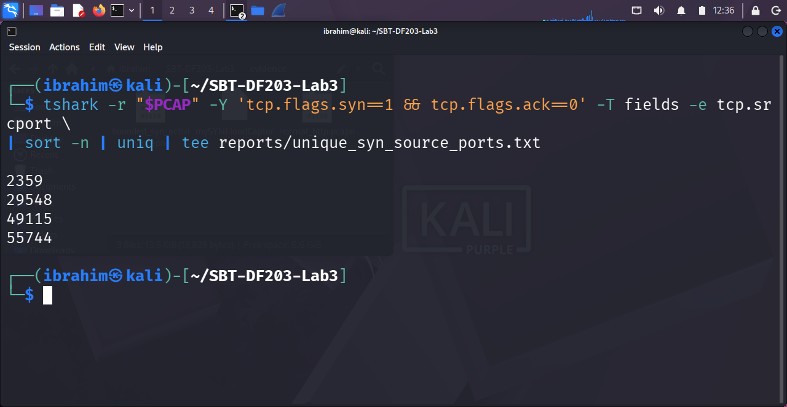

*Figure 7.2 — Four distinct ephemeral source ports: 2359, 29548, 49115, 55744.*

### 7.3 Expert Information

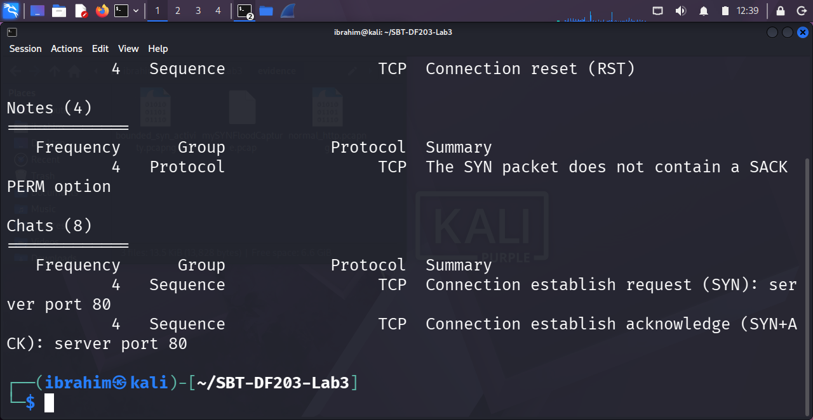

*Figure 7.3 — Wireshark expert analysis: 4 warnings (RST), 4 notes (SACK PERM missing), 8 chats (SYN and SYN+ACK).*

### 7.4 TCP Analysis Events

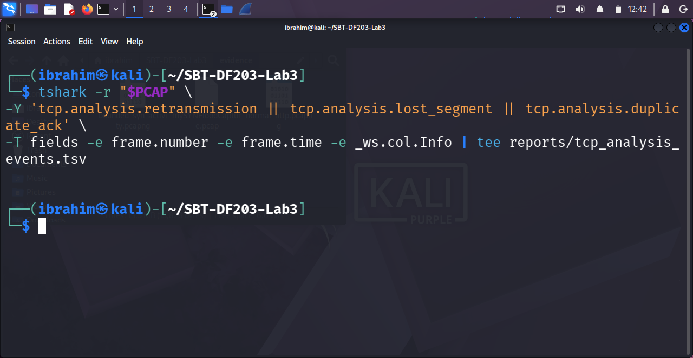

*Figure 7.4 — The `tcp.analysis.*` filter returns no rows. This is a positive finding: no retransmissions, no lost segments, no duplicate ACKs. The bounded simulation is clean at the transport-analysis level.*

---

## Key Findings

| Indicator | Normal HTTP | Bounded SYN | Forensic Meaning |
| :--- | :---: | :---: | :--- |
| Initial SYN count | 1 | 4 | Multiple SYNs from the same source |
| SYN-ACK count | 1 | 4 | Server responded to each SYN |
| Completed handshakes | 1 | 0 | No final ACK sent |
| Unique source ports | 1 (`40464`) | 4 (`2359`, `49115`, `29548`, `55744`) | Random ephemeral ports |
| HTTP request present | Yes | No | No application data |
| RST packets | 0 | 4 | Connections rejected by client OS |
| Observed duration | ~8.6 ms | ~3.0 ms | Brief burst of half-open attempts |
| TCP analysis events | 0 | 0 | No retransmissions or lost segments |

### Verdict

The capture demonstrates the **packet pattern** of a SYN flood — incomplete handshakes with no final ACK — but does **not** establish a denial-of-service event. A genuine SYN flood requires **scale, rate, persistence, and measurable service impact**, none of which are present in a four-packet bounded simulation.

---

## Repository Structure

```
SBT-DF203-Lab3-SYN-Flood-Pattern-Investigation/
├── README.md
├── SBT-DF203-Lab3_2025-FWSD-11521_Ibrahim_Diseh_Garba.pdf
├── evidence/
│   ├── normal_http.pcapng
│   └── bounded_syn_activity.pcapng
├── working/
│   └── bounded_syn_activity_working.pcapng
├── reports/
│   ├── normal_handshake_flags.tsv
│   ├── bounded_capture_hashes.txt
│   ├── initial_syns.tsv
│   ├── syn_ack_responses.tsv
│   ├── ack_reset_candidates.tsv
│   ├── syn_counts_by_pair.txt
│   ├── unique_syn_source_ports.txt
│   ├── expert_info.txt
│   └── tcp_analysis_events.tsv
├── screenshots/
│   ├── fig_3.1_folder_structure.png
│   ├── fig_3.2_tools_installed.png
│   ├── fig_3.3_wget_404.png
│   ├── fig_4.1_capture_running.png
│   ├── fig_4.2_handshake_tsv.png
│   ├── fig_4.3_wireshark_handshake.png
│   ├── fig_5.1_scapy_script.png
│   ├── fig_5.2_simulation_run.png
│   ├── fig_5.3_bounded_hashes.png
│   ├── fig_6.1_initial_syns.png
│   ├── fig_6.2_syn_acks.png
│   ├── fig_6.3_rst.png
│   ├── fig_7.1_counts.png
│   ├── fig_7.2_unique_ports.png
│   ├── fig_7.3_expert_info.png
│   └── fig_7.4_tcp_events.png
└── scripts/
    └── syn_probe_lab.py
```

---

## Evidence and Chain of Custody

| File | Size | SHA-256 |
| :--- | :---: | :--- |
| `evidence/normal_http.pcapng` | 13 KB | `6123b37efcb889f9d8f749c47549a09313db372749898a025272250982c5c7d5` |
| `evidence/bounded_syn_activity.pcapng` | 1.3 KB | `ed678f8f1b2d8a232024885605ae4f11e27ee67d15f20a114aa3d6685eacc0d1` |
| `working/bounded_syn_activity_working.pcapng` | 1.3 KB | `ed678f8f1b2d8a232024885605ae4f11e27ee67d15f20a114aa3d6685eacc0d1` |

### Case Metadata

| Field | Value |
| :--- | :--- |
| Case ID | `SBT-DF203-Lab3-2025-FWSD-11521` |
| Analyst | Ibrahim Diseh Garba |
| Registration No. | `2025/FWSD/11521` |
| Date / Time Started | 12 September 2026, 11:03 EDT |
| Analysis Workstation | Kali Linux VM (ICDFA lab) |

---

## Detection and Mitigation

### Detection Controls

| Control | Description |
| :--- | :--- |
| SYN-to-completed ratio | Alert when initial SYN count significantly exceeds completed handshakes per source |
| SYN backlog monitoring | Track `SYN-RECEIVED` queue growth and exhaustion |
| Rate-based detection | Alert on SYN rates exceeding established baselines |
| Flow telemetry | Analyse NetFlow / IPFIX records for anomalous SYN patterns |

### Mitigation Controls

| Control | Description |
| :--- | :--- |
| SYN cookies | Stateless handling of incomplete connections, preventing backlog allocation |
| Backlog tuning | Adjust TCP backlog and timeout parameters per workload profile |
| Upstream rate limiting | Rate-limit at the network edge or load balancer |
| DDoS protection | Deploy dedicated mitigation services for high-volume attacks |

---

## Safety and Ethics

This lab was executed **exclusively** within the ICDFA-approved isolated Kali Linux virtual machine.

- Target scope: **loopback only** (`127.0.0.1:80`)
- Packet limit: **four SYN packets maximum** — strictly bounded
- **No spoofing**, no external targets, no continuous sending
- No credentials, personal data, or confidential traffic collected
- All firewall, ARP, forwarding, and network settings restored after the lab
- SHA-256 hashes recorded for chain of custody

> **Warning:** The `scripts/syn_probe_lab.py` script is intended for **authorised training only**. Do not modify the packet count, do not target external systems, and do not automate repeated execution.

---

## References

1. ICDFA. (2026). *SBT-DF203 — Module 2: HTTP, tshark, SYN Flood — Course Materials*.
2. ICDFA. (2026). *SBT-DF203 Lab 3 — SYN Flood Pattern Investigation Using TShark — Official Lab Manual*.
3. RFC 793. (1981). *Transmission Control Protocol*. [IETF](https://tools.ietf.org/html/rfc793)
4. RFC 4987. (2007). *TCP SYN Flooding Attacks and Common Mitigations*. [IETF](https://tools.ietf.org/html/rfc4987)
5. Wireshark Foundation. (2026). *Wireshark User Guide*. [wireshark.org/docs](https://www.wireshark.org/docs/)
6. Scapy Project. (2026). *Scapy Documentation*. [scapy.net](https://scapy.net/)

---

## License

This repository is submitted as academic coursework for **SBT-DF203 Lab 3** at ICDFA. The contents may not be redistributed, reused, or reproduced without written permission from the author and ICDFA.

© 2026 Ibrahim Diseh Garba. All rights reserved.

---

<div align="center">
<sub>SBT-DF203 · Lab 3 · Delivery Block 1/3 · September 2026</sub>
</div>
